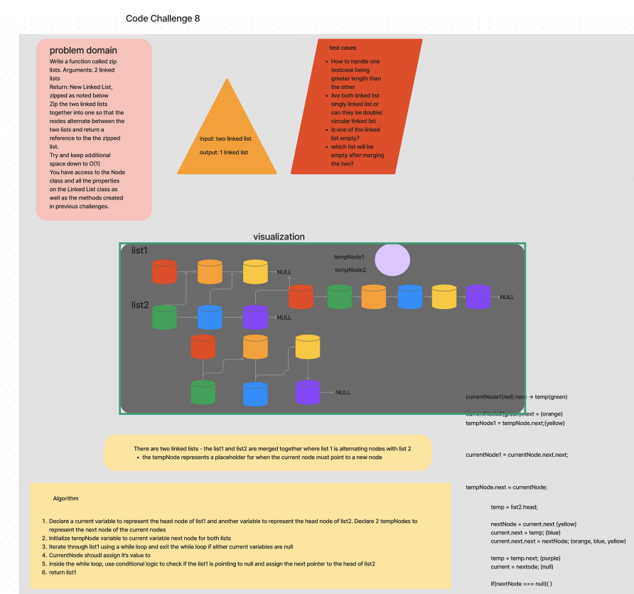
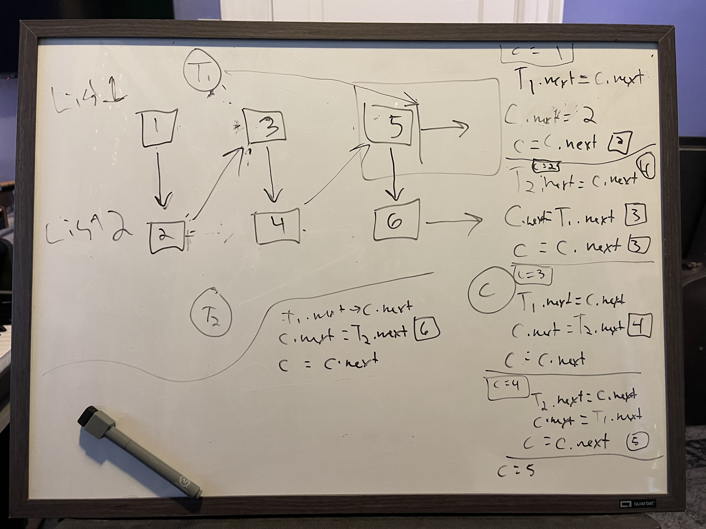

**Feature Tasks**
Write a function called zip lists
Arguments: 2 linked lists
Return: New Linked List, zipped as noted below
Zip the two linked lists together into one so that the nodes alternate between the two lists and return a reference to the the zipped list.
Try and keep additional space down to O(1)
You have access to the Node class and all the properties on the Linked List class as well as the methods created in previous challenges.

Algorithm/Pseudocode
T1 = Temp variable for list 1
T2 = Temp variable for list 2
C = current

1. Set the initial value of list one to the head of list one
2. Set the initial value of list two to the head of list 2
3. Set Current (pointer) to list one head
4. T1.next = C.next
5. C.next = list two head
6. C = C.next
7. T2.next = C.next
8. C.next = T1.next
9. C = C.next
10. T1.next = C.next...
