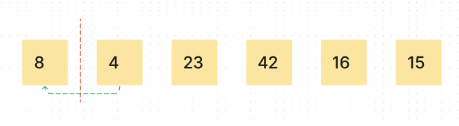
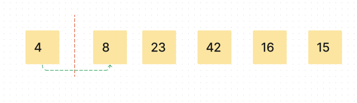
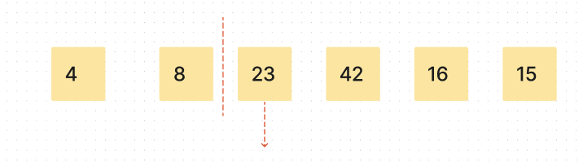
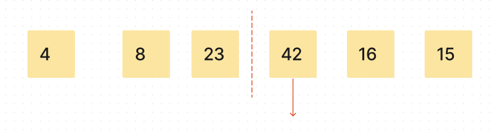
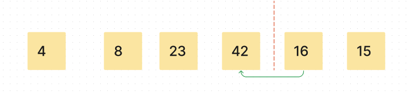
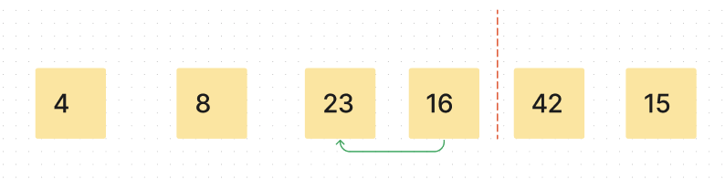
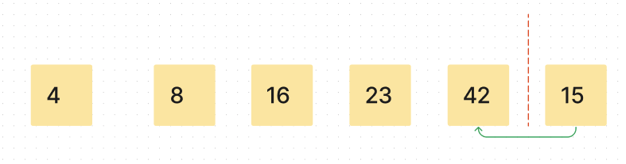
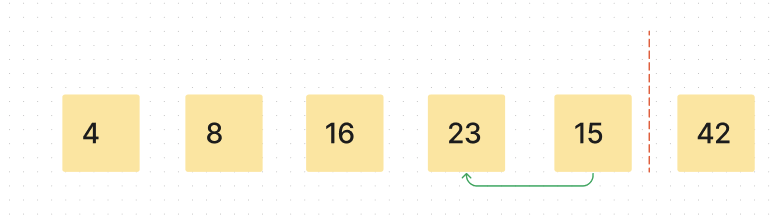
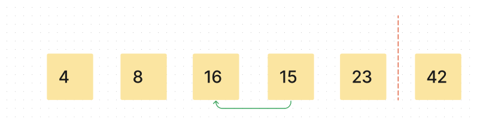
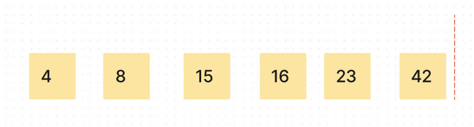

# Insertion Sort

## Sources
[w3 resource](https://www.w3resource.com/javascript-exercises/searching-and-sorting-algorithm/searching-and-sorting-algorithm-exercise-4.php#:~:text=Insertion%20sort%20is%20a%20simple,%2C%20heapsort%2C%20or%20merge%20sort.)

[geeks for geeks](https://www.geeksforgeeks.org/insertion-sort/)

[Algorithm video](https://youtu.be/OGzPmgsI-pQ)


## Algorithm

1. Set a marker for the sorted section after the first element
2. Repeat the following until the unsorted section is empty:
  1. Select the first unsorted element
  2. While elements to the left of the unsorted element are higher in value than the unsorted element, swap other elements to the right to create the correct position and shift the unsorted element left
  3. advance the marker to the right one element.

## Pseudocode

InsertionSort(int[] arr)

```
  FOR i = 1 to arr.length

    int j <-- i - 1
    int temp <-- arr[i]

    WHILE j >= 0 AND temp < arr[j]
      arr[j + 1] <-- arr[j]
      j <-- j - 1

    arr[j + 1] <-- temp
```

## Sample Arrays

[8,4,23,42,16,15]


## Implementation
Provide a visual step through for each of the sample arrays based on the provided pseudo code
Convert the pseudo-code into working code in your language

Present a complete set of working tests

temp = the marker that divides the sorted(left) and unsorted (right) sides of the array.
___
> temp = array\[1]  (value: 4)

> j is set to 0

> While loop: 0 >= 0 && 8 > 4{


___

> The POSITION with the value of four becomes the POSITION with a value of 8;

> j decrements by one (-1); }

> 0 >= 0 && 4 > 8 --> FALSE, while loop breaks;

> The temp marker increments by one  to arr\[2] (value: 23)


___

> temp = array\[2](23)

> j is reset to 1

> While loop: 1 >= 0 && 8 > 23{ --> FALSE, while loop breaks;

> The temp marker increments by one to arr\[3] (value: 42)


___
> temp = array\[3](42)

> > j is reset to 2

> While loop: 2 >= 0 && 23 > 42 { --> FALSE, while loop breaks;

> The temp marker increments by one to arr\[4] (value: 16)

___
> temp = array\[4]

> j is reset to 3

> While loop: 3 >= 0 && 42 > 16 {

> The POSITION with the value of 16 becomes the POSITION with a value of 42;

> j decrements by one (2); }


___

> While loop: 2 >= 0 && 23 > 16 {

> The POSITION with the value of 16 becomes the POSITION with a value of 23;

> j decrements by one (1); }

___
temp = array\[4]

> While loop: 1 >= 0 && 8 > 16 { --> FALSE, while loop breaks;

> The temp marker increments by one to arr\[5] (value: 15)


___
> temp = array\[5]

> j is reset to 4

> While loop: 4 >= 0 && 42 > 15 {

> The POSITION with the value of 15 becomes the POSITION with a value of 42;

> j decrements by one (3); }


___
> temp = array\[5]

> While loop: 3 >= 0 && 23 > 15 {

> The POSITION with the value of 15 becomes the POSITION with a value of 23;

> j decrements by one (2); }


___
> temp = array\[5]

> While loop: 2 >= 0 && 16 > 15 {

> The POSITION with the value of 15 becomes the POSITION with a value of 16;

> j decrements by one (2); }

> While loop: 1 >= 0 && 15 > 16 { --> FALSE, while loop breaks;

> The temp marker increments by one  to arr\[6] (value: Does not exist)

___
For loop breaks. Array is sorted.



## Code

```javascript
const insertionSort = (nums) => {
  for (let i = 1; i < nums.length; i++) {
    let j = i - 1
    let temp = nums[i]
    while (j >= 0 && nums[j] > temp) {
      nums[j + 1] = nums[j]
      j--
    }
    nums[j+1] = temp
  }
  return nums
}

let array = [8,4,23,42,16,15];

console.log(insertionSort(array));
```
___

temp = the marker at the index of the first number in the unsorted portion of the array.

i = the first unsorted element.


i represents the number to be sorted.

j represents the number on the left margin of i


While j is greater than or equal to zero, and the index of the array[j] is less than the index to be sorted...

## Blog

The Insertion Sort algorithm follows incremental approach. An incremental algorithm is given a sequence of input, and finds a sequence of solutions that build incrementally while adapting to the changes in the input. [source](https://dl.acm.org/doi/10.5555/1354605#:~:text=An%20incremental%20algorithm%20is%20given,the%20changes%20in%20the%20input.)

It is an in-place sorting algorithm because it does not need an extra space and produces an output in the same memory that contains the data by transforming the input ‘in-place’. However, a small constant extra space used for variables is allowed. [source](https://www.geeksforgeeks.org/in-place-algorithm/)

The Insertion Sort algorithm takes an array of integers as its argument, and loops through the list a number of times equal to the amount of integers in the list.

The list gets divided into a sorted part, and an unsorted part. The sorted part is on the left, and the unsorted part is on the right. It starts by looking at the value of index 1, and compares it to the value of index 0. If the value of index 0 is greater than the value of index 1, then the value of index 1 gets placed in the correct position in the sorted part.


## Big O

Time: O(N^2) - complexity is directly proportional to the square of the input size. Adding more nested iterations through the input will increase the complexity

Space: O(1) -  the amount of memory that you use is constant and does not depends on the data that it is processing


