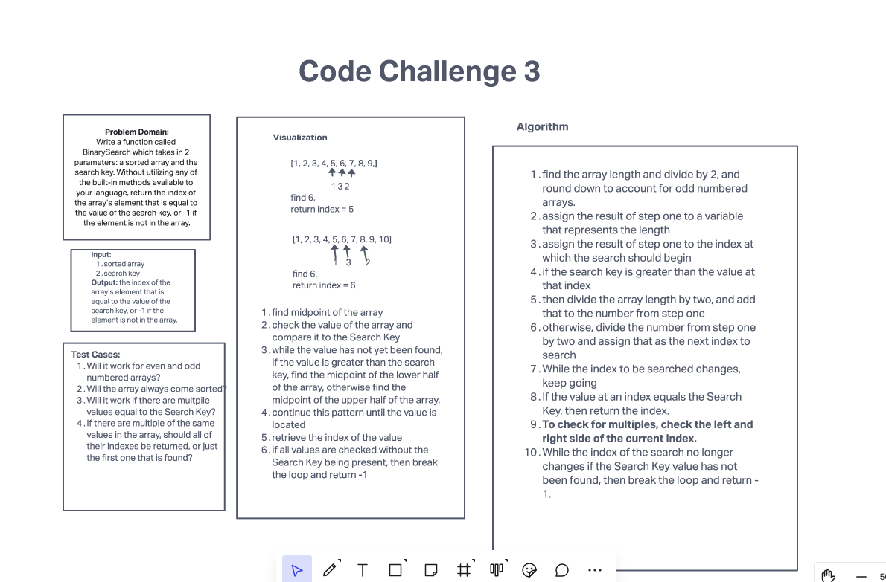

# Use Binary Search to find the index of a search key

Write a function called BinarySearch which takes in 2 parameters: a sorted array and the search key. Without utilizing any of the built-in methods available to your language, return the index of the array’s element that is equal to the value of the search key, or -1 if the element is not in the array.

## Whiteboard Process

## Approach & EfficiencyAt the time of this writing, we have not yet solved the problem. I intend to come back to this problem and get it solved once my lab is complete, but in the interest iof time I am submitting this assignment as is.

Our approach is as follows:
1. find the array length and divide by 2, and round down to account for odd numbered arrays.
2. assign the result of step one to a variable that represents the length
3. assign the result of step one to the index at which the search should begin
4. assign another variable that will track the last index used.

5. if the search key is greater than the value at that index then divide the array length by two, and add that to the number from step one
6. otherwise, divide the number from step one by two and assign that as the next index to search
7. While the index to be searched changes, keep going
8. If the value at an index equals the Search Key, then return the index.
9. To check for multiples, check the left and right side of the current index.
10. While the index of the search no longer changes if the Search Key value has not been found, then break the loop and return -1.

I can see at this point that to solve this, I weill be adding or subtracting the variables for length and the last two references. Once I work out the match, I know I can get this. 
