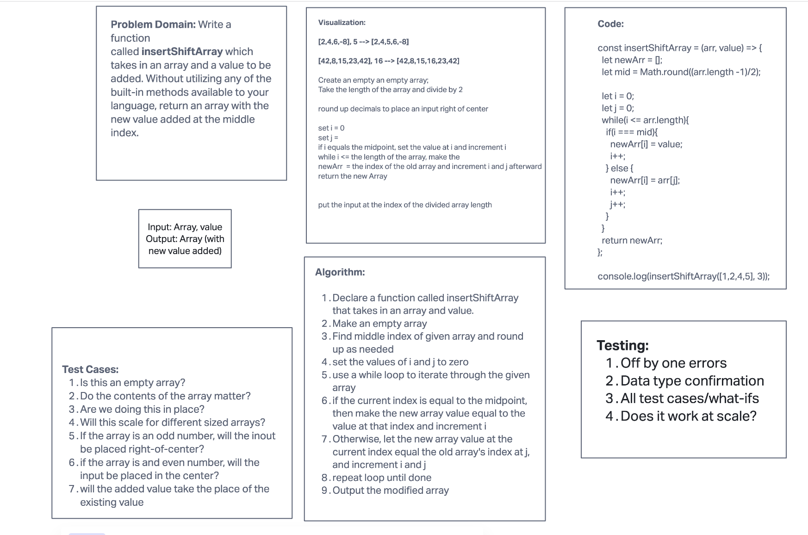

# Insert a value into the middle of an array

Write a function called insertShiftArray which takes in an array and a value to be added. Without utilizing any of the built-in methods available to your language, return an array with the new value added at the middle index.

## Whiteboard Process

## Approach & Efficiency
There are three moments in time to account for:
1. The first half of the array
2. The new middle value
3. The last half of the array

Both the new array and the original array require counters to track (and refer back to) their indexes. i = newArray, j = originalArray

The values of the first half of the new array will be the same as the first half of the original array.

Use a while loop where i is less than OR EQUAL TO the length of the original array.

When the value of i === the value of (the original array, minus one, divided by two, rounded up to the nearest whole number...
... then make the new Array value at index i equal to the value argument.

Then increment i

Otherwise, set the newArray value\[i] equal to the oldArray value \[j]. The, increment both i and j.
