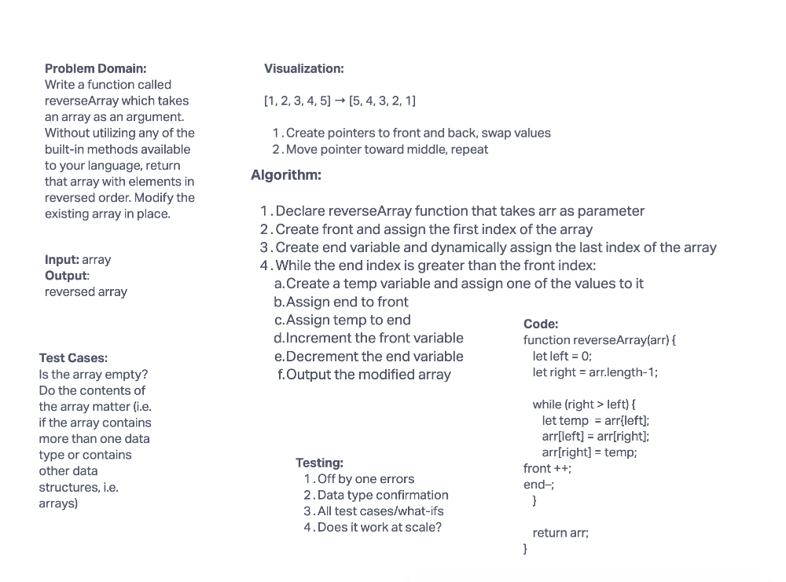

# Reverse an Array

Write a function called reverseArray which takes an array as an argument. Without utilizing any of the built-in methods available to your language, return an array with elements in reversed order.

## Whiteboard Process

## Approach & Efficiency
The approach that was taken today in class is the same as has been used here. The function will move from outside of the array toward the mniddle. It will look at the element on the left and right sides of the array, swap their index locations, and then move toward the center. To accomplish this, a while loop is used with the condition being set to keep the loop going while the left side's index is less than the right side's index.

This approach is more efficient than working from one side to another, and should take half the time.
